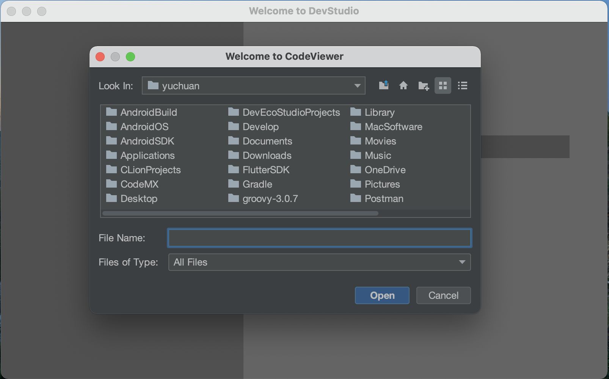
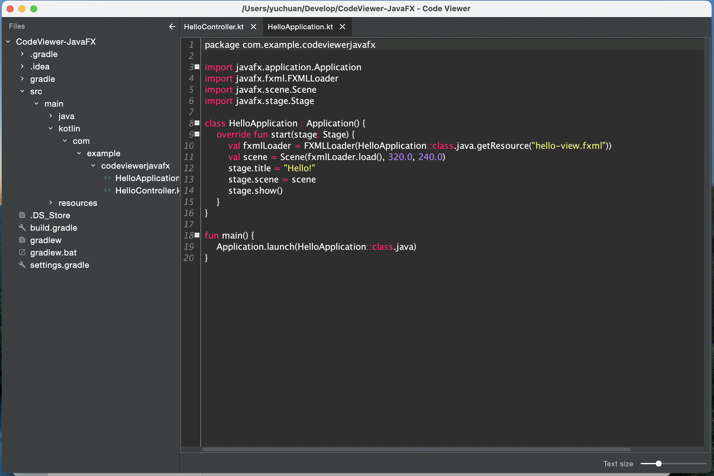
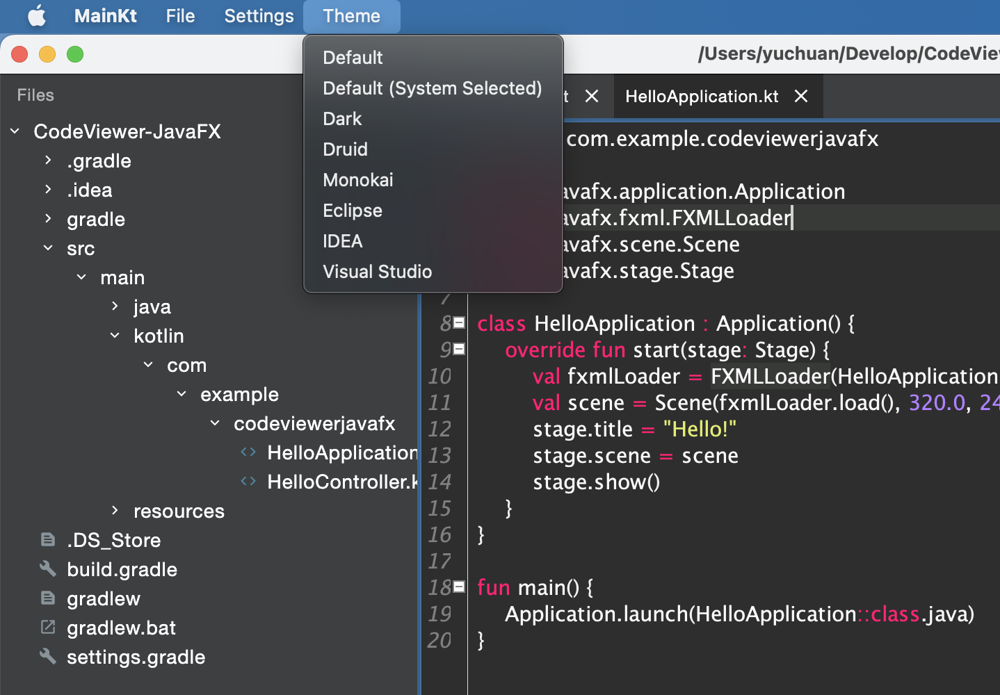

Notepad example for desktop written in Compose for Desktop library, using Composable Window API

## Update MSG

### 2022-01-14
> add tornadofx2 library
> https://github.com/edvin/tornadofx2

## Running desktop application
```
./gradlew run
```

## Building native desktop distribution
```
./gradlew package
# outputs are written to build/compose/binaries
```

## Development Source
* https://www.rgagnon.com/javadetails/java-0370.html -- Directory chooser
* https://github.com/atarw/material-ui-swing   
* https://github.com/sherter/google-java-format-gradle-plugin
* flatlaf: New UI like Intellij IDEA






